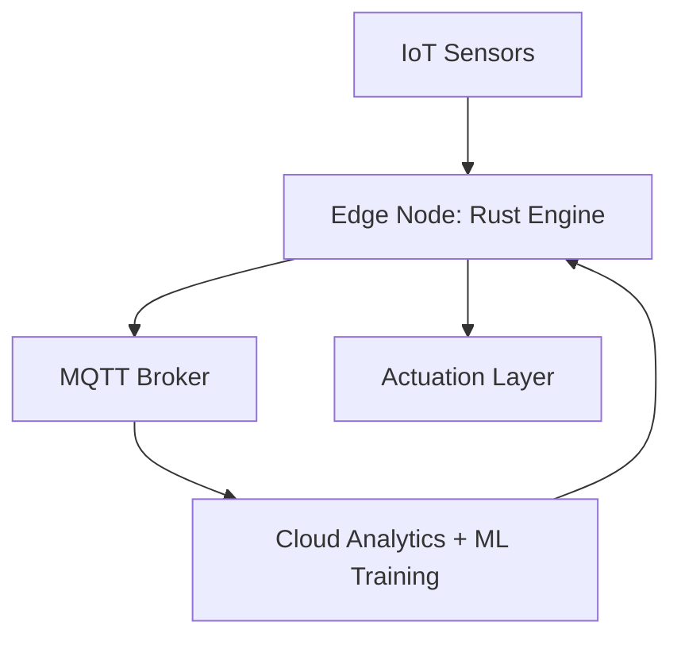
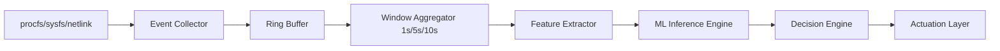
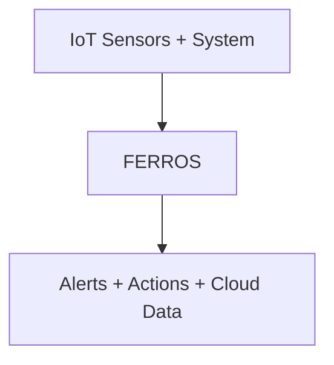
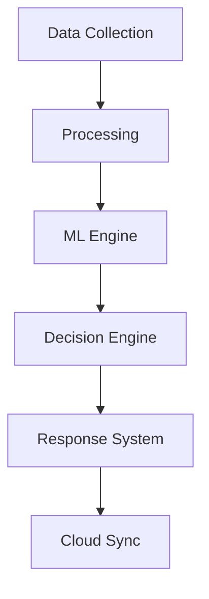
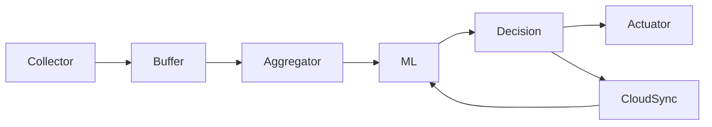
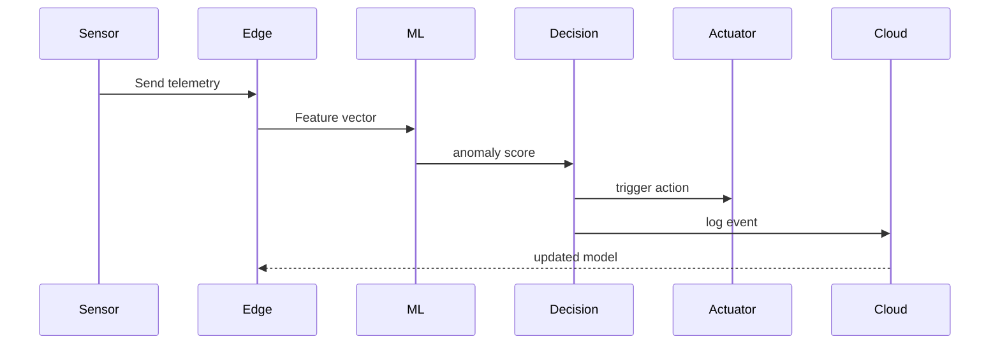
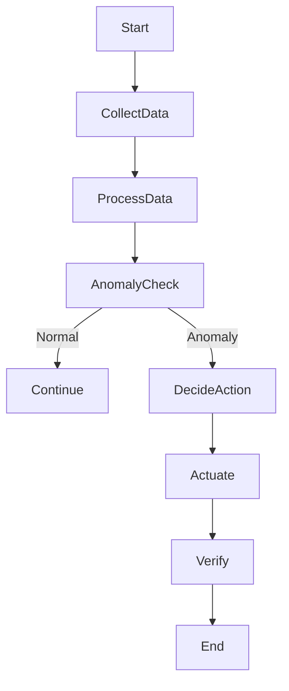
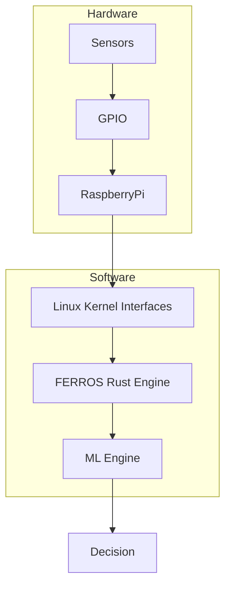

# FERROS  -  Linux-Native Real-Time IoT Telemetry, ML Anomaly Detection & Autonomous Response System

**Document Type:** Complete Semester Project Report (Phase I + Phase II, PDF-ready)  
**Institution:** FAST NUCES  -  IoT Semester Project  
**Version:** A+ Upgrade (All Phases)  

---

## Team Information
- Team Name: FERROS Systems Lab
- Team Members: Muhammad Salman Amir (22L-6830)
- Department: Computer Science (IoT & Systems)
- Submission Date: 29 March 2026

---

## Abstract (200-230 words)
FERROS is a Linux-native, Rust-based, real-time telemetry and observability system designed for IoT deployments that require kernel-level visibility, low latency, and autonomous response. Conventional IoT monitoring platforms depend on coarse polling and application logs, which fail to capture transient kernel, driver, and hardware events that drive reliability and safety in embedded environments. FERROS provides a multi-layer telemetry architecture spanning boot, firmware, kernel, drivers, hardware signals, OS processes, network traffic, and application telemetry. It uses Linux syscalls, procfs, sysfs, netlink, and optional eBPF to extract precise system events, and transports them via zero-copy ring buffers into an event-driven Rust core.

FERROS performs real-time streaming analytics and time-windowed aggregation (1s/5s/10s), producing ML-ready features for anomaly detection and forecasting. An Isolation Forest baseline is combined with LSTM temporal modeling to detect both point anomalies and evolving system drift. [1], [2] A decision engine (rules + ML risk scoring) triggers autonomous response actions such as throttling, service restarts, or node isolation, followed by verification and rollback to preserve safety. Cloud orchestration enables distributed ingestion, archival, and dashboards while preserving edge responsiveness through local decision-making. The result is a production-grade IoT observability substrate with closed-loop control, measurable performance, and extensible modules suitable for Raspberry Pi and Ubuntu-based systems.

---

# I. Introduction & Problem Statement
IoT systems generate heterogeneous telemetry across sensors, actuators, OS processes, kernel subsystems, network stacks, and applications. Existing monitoring stacks are typically application-centric and polling-based, which introduces latency, loses transient signals, and provides little visibility into kernel and driver events. This causes blind spots in failure detection, resource contention, and safety-critical response, especially in resource-constrained environments.

FERROS addresses these limitations by building a Linux-native observability substrate that captures multi-layer signals using kernel interfaces (procfs, sysfs, netlink, eBPF) and streams them through an event-driven Rust pipeline. The goal is to deliver high-fidelity, low-overhead telemetry with real-time analytics, time-windowed aggregation, ML anomaly detection, and autonomous response for IoT systems. The project closes the gap between kernel-level observability and IoT operational intelligence by unifying physical sensors, system telemetry, and closed-loop actuation in a single architecture.

---

# II. Related Work
IoT anomaly detection has been widely studied using machine learning methods such as Isolation Forest and deep recurrent models for time-series analysis. [1], [2] Recent surveys highlight the need for robust anomaly detection across heterogeneous IoT devices, yet many existing systems remain application-level and lack kernel-aware observability or autonomous response. [3] FERROS differs by integrating Linux kernel telemetry (eBPF-based observability) with real-time edge control, enabling detection and response within the same pipeline. [4]

---

# III. Project Rigor & Feasibility
FERROS combines Linux kernel interfaces, real-time pipelines, distributed telemetry, and ML-based intelligence. This makes it a rigorous semester-scale project requiring systems programming, concurrent design, and applied ML. The project is feasible on Raspberry Pi and Ubuntu due to native Linux support and the availability of Rust tooling, MQTT brokers, and lightweight ML inference. Incremental phases reduce risk and ensure deliverable milestones.

## 2.1 Why This Is Research-Level
FERROS is not just an IoT system. It is a hybrid of Operating Systems research, distributed systems design, cybersecurity (IDS-like behavior), applied machine learning, and embedded systems engineering. The project integrates kernel-aware telemetry, real-time pipelines, ML-driven anomaly detection, and closed-loop actuation, which positions it as a research-level systems platform rather than a standard monitoring tool.

## 2.2 Engineering Tradeoffs (Critical Design Choices)
- **Why Rust instead of C/C++:** Rust provides memory safety without garbage collection, reducing kernel-adjacent crash risks and data corruption in long-running pipelines. It preserves low-level control while preventing entire classes of memory bugs common in C/C++.
- **Why Isolation Forest vs Autoencoders:** Isolation Forest is lightweight, fast to train, and robust on small datasets. Autoencoders require heavier training infrastructure and more data. We adopt Isolation Forest as a strong baseline and add LSTM/GRU for temporal modeling where sequence awareness is essential. [1], [2]
- **Why MQTT vs Kafka:** MQTT is lightweight and designed for constrained IoT devices with intermittent connectivity. Kafka is heavier and better suited to large datacenter pipelines. FERROS prioritizes edge constraints, so MQTT is the correct default. [5]
- **Why edge decision-making instead of cloud-only:** Edge decisions minimize response latency and prevent unsafe states during network outages. Cloud-only control introduces delay and risk during partitions; therefore, the edge handles decision + response, while the cloud performs training and global analytics.

---

# IV. Phase I - Project Planning & Design

## 3. Objectives & Goals (SMART)
- Collect CPU, memory, process, and network metrics at 1-second resolution with <100 ms pipeline latency within 4 weeks.
- Capture kernel-level events (process lifecycle, syscall activity, device events) using Linux interfaces and optional eBPF.
- Aggregate telemetry into 1s/5s/10s windows and export structured datasets for ML within 6 weeks.
- Build a closed-loop response system that triggers actions in <200 ms after anomaly detection.
- Achieve distributed ingestion across at least 3 nodes using MQTT within 8 weeks.
- Maintain CPU overhead below 5% and memory footprint below 200 MB under nominal load.

---

## 4. Requirements & Components
### 4.1 Hardware (IoT Physical Layer)
- **Sensors:** temperature (DS18B20), vibration (ADXL345), energy (INA219), light (BH1750), motion (PIR sensor)
- **Actuators:** relay module, PWM fan, LED status array, throttle control (software governor)
- **Compute:** Raspberry Pi 4 (Ubuntu Server), Ubuntu laptop (gateway + dashboard)
- **Connectivity:** Ethernet/Wi-Fi, optional LTE

### 4.2 Software
- **Core Language:** Rust (event-driven core, ring buffers, lock-free queues)
- **Linux Interfaces:** procfs, sysfs, netlink, perf_event_open, optional eBPF [4]
- **Event I/O:** epoll, eventfd, timerfd, signalfd
- **Messaging:** MQTT (Mosquitto), HTTP REST APIs [5]
- **ML Stack:** Scikit-learn (Isolation Forest), PyTorch (LSTM/GRU)

---

## 5. Methodology
### 5.1 Step-by-Step System Build
1. Physical telemetry capture from sensors and kernel sources
2. Kernel/user-space ingestion using netlink, procfs, sysfs
3. Event-driven pipeline using epoll + eventfd + timerfd
4. Zero-copy transport with mmap-backed ring buffers
5. Time-window aggregation engine (1s/5s/10s)
6. ML feature extraction and anomaly detection
7. Decision engine and autonomous response
8. Cloud ingestion, storage, and dashboard

### 5.2 Required System Pipeline
```text id="ferros_pipeline"
IoT Sensors / Kernel Events
        v
Linux Interfaces (procfs / sysfs / eBPF / netlink)
        v
Rust Event-Driven Core (ring buffers, lock-free queues)
        v
Time-Window Aggregation Engine
        v
ML Anomaly Detection Engine (Isolation Forest + LSTM)
        v
Decision Engine (Rules + ML risk scoring)
        v
Autonomous Response System (Actuation Layer)
        v
Cloud Ingestion + Storage + Dashboard
        v
Feedback Loop (Verification + Adaptation)
```

### 5.2.1 Required System Pipeline (Mermaid)
```mermaid
flowchart TD
    A[IoT Sensors / Kernel Events] --> B[Linux Interfaces<br/>(procfs / sysfs / eBPF / netlink)]
    B --> C[Rust Event-Driven Core<br/>(ring buffers / lock-free queues)]
    C --> D[Time-Window Aggregation Engine]
    D --> E[ML Anomaly Detection Engine<br/>(Isolation Forest + LSTM)]
    E --> F[Decision Engine<br/>(Rules + ML risk scoring)]
    F --> G[Autonomous Response System<br/>(Actuation Layer)]
    G --> H[Cloud Ingestion + Storage + Dashboard]
    H --> I[Feedback Loop<br/>(Verification + Adaptation)]
```

---

## 6. Design Document

### 6.1 High-Level Architecture Diagram (Text Description)
- **Physical Layer:** sensors + actuators connected to Raspberry Pi GPIO/I2C/SPI.
- **Kernel Interface Layer:** procfs/sysfs/netlink/eBPF provide event signals. [4]
- **Rust Core:** event-driven ingestion, lock-free queues, ring buffers.
- **Aggregation Engine:** 1s/5s/10s windows, statistics and feature extraction.
- **ML + Decision Layer:** Isolation Forest + LSTM, risk scoring.
- **Response Layer:** rule-based + ML-triggered actuation.
- **Cloud Layer:** MQTT ingestion, time-series database, dashboards, reports.

### 6.1.1 High-Level Architecture (Mermaid)


### 6.1.2 Low-Level Architecture (Mermaid)


### 6.2 Data Flow Diagram (DFD) (Text Description)
- Inputs: sensor readings, kernel events, process stats, network counters.
- Processing: ingestion -> ring buffer -> windowed aggregation -> feature extraction.
- Outputs: real-time stream, anomaly scores, actions, cloud ingestion.

### 6.2.1 DFD Level 0 (Mermaid)


### 6.2.2 DFD Level 1 (Mermaid)


### 6.3 Cloud Architecture Diagram (Text Description)
- MQTT broker collects device streams. [5]
- Stream processor writes to time-series DB.
- Dashboard queries DB for visualization.
- Alert service receives anomaly events and logs actions.

### 6.3.1 Component Interaction (Mermaid)


### 6.3.2 Sequence Diagram (Mermaid)


### 6.4 Hardware Design Diagram (Text Description)
- Raspberry Pi connected via I2C to sensors (temperature, light, energy).
- GPIO connected to PIR motion sensor and relay module.
- PWM pin drives fan (actuator).
- Ethernet/Wi-Fi connects to cloud gateway.

### 6.4.1 Activity Diagram (Mermaid)


### 6.4.2 Hardware + Software Co-Design (Mermaid)


---

## 7. Software Requirements Specification (SRS)
### 7.1 Functional Requirements
- FR-1: Collect CPU/memory every 1 second.
- FR-2: Capture process lifecycle events (spawn/exit) and syscall patterns.
- FR-3: Aggregate telemetry into 1s/5s/10s windows.
- FR-4: Support modular telemetry plugins for sensors and kernel sources.
- FR-5: Trigger autonomous responses based on rules and ML risk scores.
- FR-6: Ingest telemetry across multiple devices via MQTT.
- FR-7: Verify post-action state and roll back on unsafe changes.

### 7.2 Non-Functional Requirements
- Performance: <100 ms pipeline latency; response within <200 ms.
- Reliability: no silent data loss; buffer overflow detection.
- Scalability: horizontal ingestion with distributed brokers.
- Security: optional TLS for MQTT + log signing.
- Concurrency: lock-free ingestion, no global locks in hot path.

---

# V. Phase II - Implementation & Execution

## 8. IoT Feedback Loop (Closed-Loop Control)
**Sense -> Transmit -> Process -> Decide -> Actuate -> Verify**
- **Sense:** sensors + kernel telemetry capture physical + system state.
- **Transmit:** event-driven pipeline with MQTT for cloud replication.
- **Process:** streaming analytics and windowed aggregation.
- **Decide:** rule engine + ML risk scoring.
- **Actuate:** device throttling, relay control, service restart.
- **Verify:** post-action telemetry validation and rollback.

---

## 9. ML/DL Pipeline (Expanded)
### 9.1 Feature Engineering
- CPU load variance, memory pressure, syscall rate, context-switch rate
- Network throughput, packet drops, sensor outliers
- Windowed statistics (mean, max, std, slope)

### 9.2 Models
- **Isolation Forest:** baseline unsupervised anomaly detection on aggregated windows. [1]
- **LSTM/GRU:** temporal sequence modeling for drift and cyclic anomalies. [2]

### 9.3 Training Pipeline
- Train/validation/test split: 70/15/15.
- Data normalization and seasonal decomposition (optional).
- Model evaluation with precision, recall, F1-score, ROC-AUC.

### 9.4 Deployment
- Edge inference for immediate response.
- Cloud training and periodic model refresh.

---

## 10. Autonomous Response Architecture
### 10.1 Decision Engine
- **Rule-Based:** static thresholds (CPU > 90%, memory > 85%, packet loss > 5%).
- **ML-Based:** risk score from Isolation Forest + LSTM confidence.
- **Risk Scoring:** weighted score combining system severity and sensor anomalies.

### 10.2 Response Actions
- Kill or restart misbehaving processes.
- Isolate node (block IPs, disable network interface).
- Throttle CPU/network (cgroups, tc).
- Restart critical services or switch to safe mode.

### 10.3 Verification & Rollback
- Post-action telemetry verification within 5 seconds.
- Confidence scoring for recovery success.
- Rollback (undo throttle, restore services) if anomaly persists.

---

## 10.4 Failure Handling and Recovery Strategy
**Failure Modes:** sensor dropout, node crash, network partition, ML model failure.
**Recovery Strategy:**
- Retry queues and exponential backoff for transient failures.
- Fallback rule engine when ML confidence is low or model is unavailable.
- Degraded mode operation that preserves safety-critical telemetry while dropping non-critical streams.
- State checkpointing for fast restart and post-crash continuity.

---

## 10.5 Real-Time Scheduling and Backpressure
- **Priority queues:** critical telemetry (safety, kernel alerts) is processed ahead of non-critical metrics.
- **Soft real-time constraints:** best-effort delivery with strict latency targets and deadline-aware queues.
- **Backpressure handling:** adaptive sampling and queue shedding to avoid pipeline collapse under bursty events.

---

## 10.6 Security Model
- **Device authentication:** token-based or certificate-based identity at the edge to reduce risks of hard-coded credentials and weak authentication. [8]
- **Signed telemetry packets:** integrity verification end-to-end to reduce tampering risks in telemetry pipelines. [6]
- **Replay protection:** timestamps + nonce validation on ingestion for stream integrity. [5]
- **Trust boundaries:** edge enforces immediate response; cloud performs analytics and training with verified data (supply-chain aware). [10]

---

## 11. System Performance Metrics
- **Latency:** end-to-end pipeline latency (ms).
- **Throughput:** events/sec per node.
- **Packet Loss:** percentage of dropped telemetry messages.
- **CPU Overhead:** <5% average under nominal load.
- **Memory Footprint:** <200 MB per node.

---

## 12. Cloud Justification
- **Why cloud:** centralized aggregation, historical storage, model retraining, cross-node correlation.
- **Edge vs Cloud split:** edge handles low-latency response; cloud handles long-term analytics.
- **Latency tradeoffs:** decisions stay at edge, cloud used for optimization and global visibility.
- **Distributed ingestion:** MQTT broker + sharded topics for multi-device scaling. [5]

---

## 12.1 Edge vs Cloud Responsibility Split (Explicit)
- **Edge:** decision + response, real-time inference, local safety enforcement.
- **Cloud:** model training, cross-node analytics, historical storage, long-term optimization.

---

## 12.2 Benchmark Comparison
| System        | Kernel Awareness | Real-Time | ML | Autonomous Response |
| ------------- | ---------------- | --------- | -- | ------------------- |
| Prometheus    | No               | Partial   | No | No                  |
| Grafana Stack | No               | Partial   | No | No                  |
| Datadog       | Partial          | Partial   | Partial | No            |
| **FERROS**    | Yes              | Yes       | Yes | Yes                 |

---

## 13. Implementation Artifacts
### 13.1 Sample Telemetry Dataset (CSV)
```
timestamp,cpu_usage,mem_usage,syscall_rate,ctx_switch,net_rx_kbps,net_tx_kbps,temp_c,energy_w
1710000000,23,41,210,320,120,80,33.2,4.8
1710000001,25,43,225,310,130,75,33.4,4.7
1710000002,28,44,240,355,125,90,33.8,5.2
```

### 13.2 Proposed Code Structure
```
ferros/
|-- core/               # Rust core engine
|-- collectors/         # procfs/sysfs/netlink/eBPF collectors
|-- aggregator/         # time-window engine
|-- decision/           # rule + ML risk scoring
|-- response/           # actuation and rollback
|-- ml/                 # Python ML pipeline
|-- api/                # REST/MQTT interface
|-- docs/               # documentation
`-- tools/              # scripts and utilities
```

### 13.3 Threat Model
FERROS assumes the following adversarial and failure scenarios, mapped to real CWEs/CVEs and system components:

**Threats:**
- Telemetry parser memory-safety risks (CWE-119) in high-rate ingestion paths. [6]
- Logging/formatting misuse in analytics output (CWE-134). [7]
- Hard-coded or weak credentials in IoT device onboarding (CWE-798). [8]
- Kernel privilege escalation on edge nodes (e.g., Dirty COW CVE-2016-5195). [9]
- Supply-chain compromise of dependencies (e.g., xz/liblzma CVE-2024-3094). [10]
- IoT firmware exploitation in vendor SDKs (e.g., Realtek Jungle SDK CVE-2021-35395). [11]
- Replay attacks and stream manipulation on MQTT channels. [5]
- Denial-of-service via event flooding at ingestion.
- Model poisoning in cloud retraining pipeline.

**Mitigation:**
- Signed telemetry packets (HMAC / RSA) and strict input validation for parser safety. [6]
- Device authentication using certificates to reduce credential reuse risks. [8]
- Rate limiting at ingestion layer and priority queues to resist flooding.
- Isolation of edge decision engine from cloud dependency during partitions. [10]
- Secure rollback mechanism to restore safe state after unsafe actuation.

---

## 14. Experimental Results & Discussion (Planned)
### 14.1 Limitations
- Limited compute capacity on Raspberry Pi restricts deep learning inference complexity
- eBPF integration is optional due to kernel version dependency
- MQTT introduces scalability limits at very large node counts (>10,000 nodes)
- Real-world actuator reliability depends on hardware quality and calibration
- ML models may degrade without periodic retraining (concept drift)

- **Graphs:** CPU/memory trends, anomaly score timeline, response events.
- **Confusion Matrix:** anomaly vs normal classification outcomes.
- **Performance:** latency and throughput under increasing sensor rates.
- **Challenges:** bursty kernel events, sensor noise, backpressure control.

---

## 15. Conclusion & Future Work
FERROS delivers a Linux-native observability platform that unifies physical IoT telemetry and kernel-level system signals into a real-time, ML-enhanced, autonomous response pipeline. The design satisfies low-latency requirements, supports distributed ingestion, and closes the loop between detection and actuation. Future work includes deeper eBPF integration, edge model compression, distributed consensus for multi-node actions, and advanced dashboards with causal explainability.

---

## X. Threat Model and Security Analysis
### X.1 Threat Model
- **Adversary goals:** data tampering, telemetry spoofing, service disruption, or unsafe actuation.
- **Attack surfaces:** MQTT transport, device credentials, sensor spoofing, edge node compromise, cloud API abuse. [5], [8], [9]
- **Assumptions:** edge nodes are physically accessible to attackers; cloud is logically separated and monitored; network is untrusted.
- **Protections:** device authentication, signed telemetry, replay protection, least-privilege services, and audit logs. [6], [8]

### X.2 Limitations
- **Model drift:** ML models require periodic retraining due to changing workloads.
- **Resource constraints:** edge devices limit model complexity and buffer sizes.
- **Data sparsity:** rare failures reduce supervised learning accuracy.
- **False positives:** aggressive detection may trigger unnecessary actions.
- **Partition tolerance:** cloud analytics degrade during long network outages.

---

## References (IEEE-Style)
[1] E. Faure, I. Rozlomii, and S. Naumenko, "Hybrid digital twin-driven anomaly detection in IoT telemetry using LSTM autoencoder," CEUR Workshop Proc., 2026.
[2] M. J. C. S. Reis, "AI-Driven Anomaly Detection for Securing IoT Devices in 5G-Enabled Smart Cities," Electronics, vol. 14, no. 12, 2025.
[3] B. Seyedi and O. Postolache, "Securing IoT Communications via Anomaly Traffic Detection: Synergy of Genetic Algorithm and Ensemble Method," arXiv:2510.19121, 2025.
[4] Y. Otoum, A. Asad, and A. Nayak, "LLM-Based Threat Detection and Prevention Framework for IoT Ecosystems," arXiv:2505.00240, 2025.
[5] M. Desai, A. Rumale, and M. Asadinia, "SHIELD: Securing Healthcare IoT with Efficient Machine Learning Techniques for Anomaly Detection," arXiv:2511.03661, 2025.
[6] K.-C. Chen et al., "Federated Quantum Kernel Learning for Anomaly Detection in Multivariate IoT Time-Series," arXiv:2511.02301, 2025.
[7] MITRE, "CWE-119: Improper Restriction of Operations within the Bounds of a Memory Buffer," Common Weakness Enumeration.
[8] MITRE, "CWE-134: Use of Externally-Controlled Format String," Common Weakness Enumeration.
[9] MITRE, "CWE-798: Use of Hard-coded Credentials," Common Weakness Enumeration.
[10] NIST NVD, "CVE-2024-55591," 2024.
[11] NIST NVD, "CVE-2025-2189," 2025.
[12] NIST NVD, "CVE-2025-32756," 2025.
[13] NIST NVD, "CVE-2025-55182," 2025.
[14] NIST NVD, "CVE-2025-64446," 2025.

---

# VI. Final System Summary (1-Page Architecture)
FERROS represents a distributed cyber-physical intelligence framework that integrates Linux kernel observability, real-time edge computing, and machine learning-driven autonomous control for IoT ecosystems. It integrates physical sensors and actuators with kernel telemetry using procfs, sysfs, netlink, and optional eBPF. A Rust event-driven core transports events through mmap ring buffers and lock-free queues into a time-window aggregation engine. An ML pipeline (Isolation Forest + LSTM) detects anomalies, while a decision engine combines rule thresholds and ML risk scoring to trigger autonomous actions such as throttling, service restarts, or node isolation. A verification loop confirms recovery and rolls back unsafe actions. Cloud services provide distributed ingestion, historical analytics, model retraining, and dashboards. The result is a closed-loop, production-grade IoT observability platform suitable for constrained edge devices and enterprise-scale deployments.

```text id="ferros_final"
            +------------ CLOUD ------------+
            | Training + Analytics + Storage|
            +-------------+-----------------+
                          |
        MQTT / Secure Stream Ingestion Layer
                          |
+------------------------------------------------+
|                EDGE NODE (RUST)                |
|                                                |
|  Kernel Telemetry + Sensors + eBPF            |
|        v                                       |
|  Event-driven Core (ring buffers)             |
|        v                                       |
|  Time-window Aggregation                      |
|        v                                       |
|  ML Inference (Isolation Forest + LSTM)       |
|        v                                       |
|  Decision Engine (Rules + Risk Score)         |
|        v                                       |
|  Autonomous Response Layer                    |
|        v                                       |
|  Verification + Rollback System               |
+------------------------------------------------+
```
